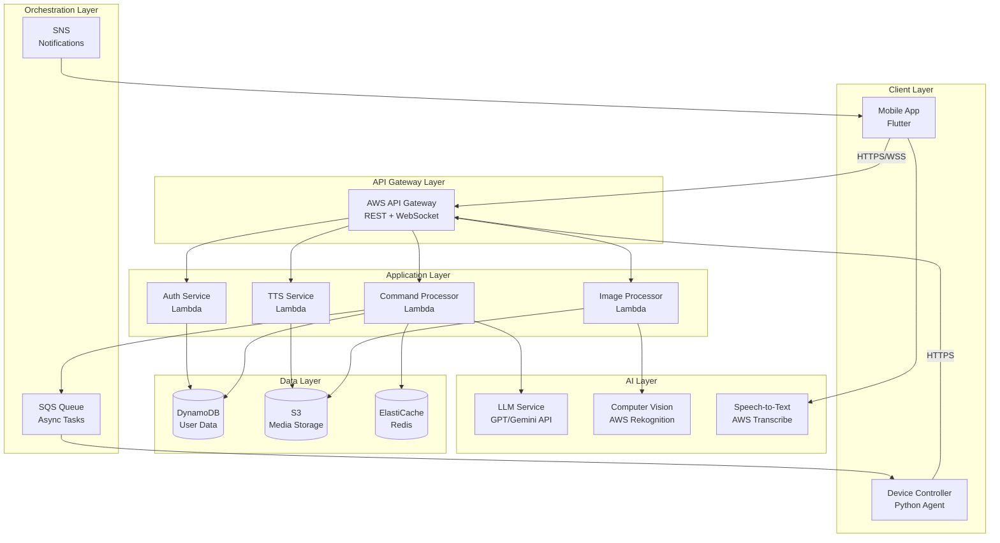
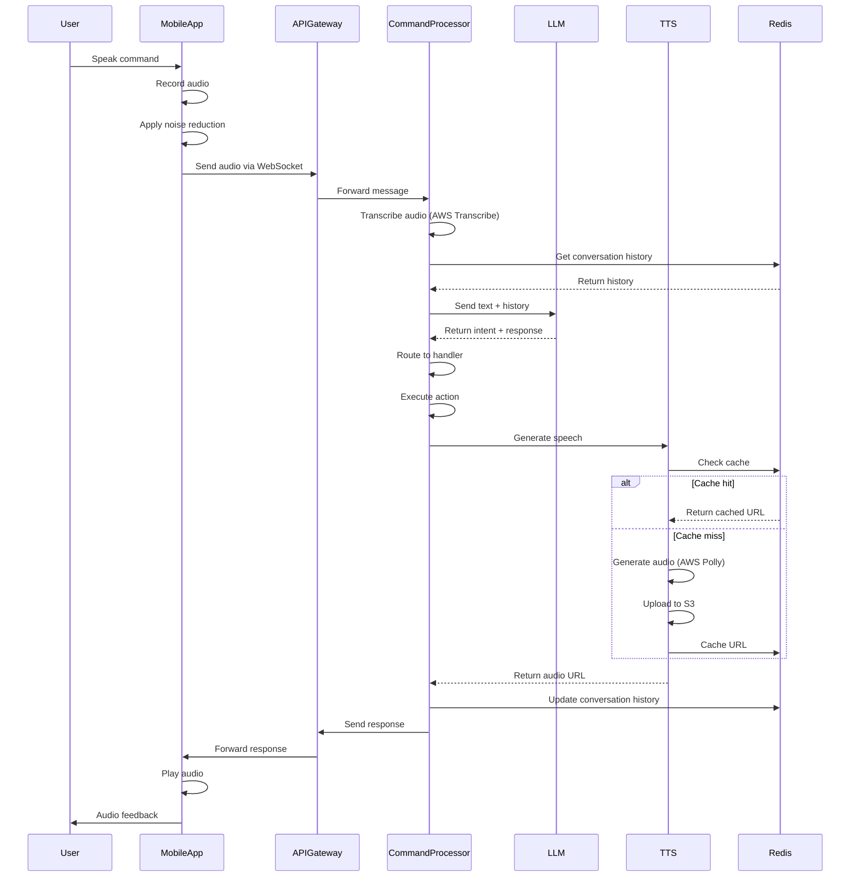
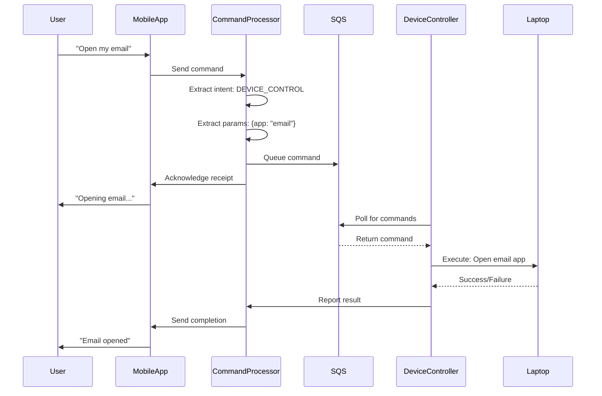
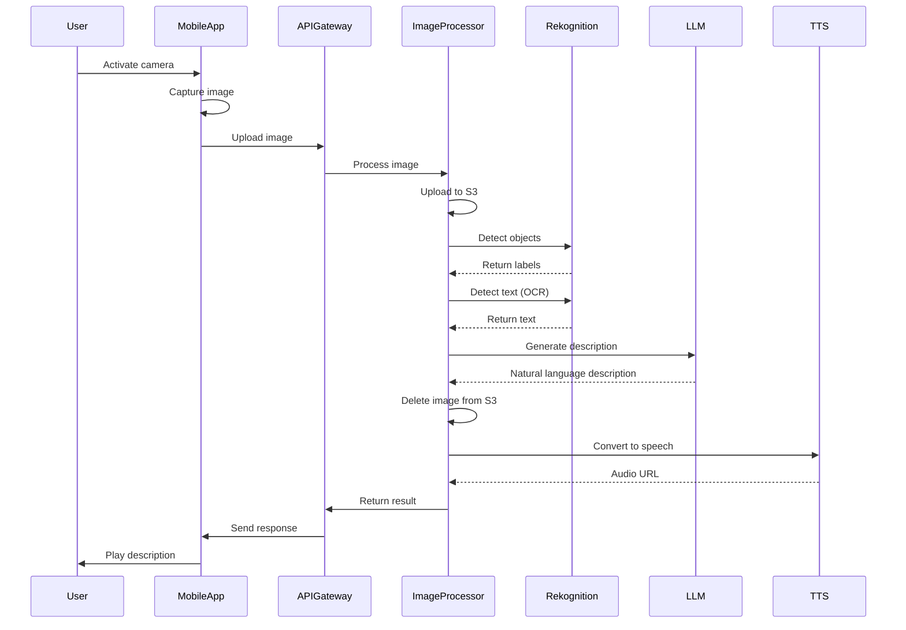
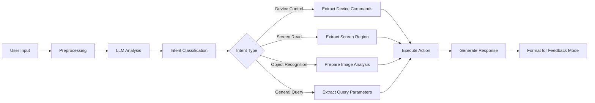
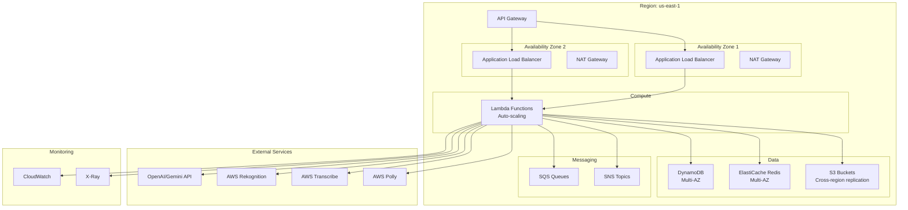

# Design Document: Athena Accessibility System

## Overview

Athena is a cloud-native, AI-powered accessibility platform that enables visually and hearing impaired users to interact with digital devices and their physical environment through natural language. The system employs a distributed architecture with a Flutter mobile application, cloud-based backend services, AI processing via LLM APIs, and a device control agent for laptop automation.

The architecture follows a microservices pattern deployed on AWS, with real-time communication via WebSockets, asynchronous processing via message queues, and scalable compute via Lambda functions. The system prioritizes low latency (<2s for voice, <1s for text), high availability (99.5% uptime), and multimodal feedback (audio, text, haptic) to serve diverse accessibility needs.

### Key Design Principles

1. **Accessibility First**: Every component designed with WCAG 2.1 Level AA compliance
2. **Low Latency**: Optimized data flow and caching to minimize response times
3. **Fault Tolerance**: Graceful degradation and offline capabilities
4. **Scalability**: Serverless architecture that scales with demand
5. **Security**: End-to-end encryption and privacy-preserving AI processing
6. **Modularity**: Loosely coupled services for independent scaling and updates

## Architecture

### High-Level System Architecture



### Architecture Layers

**Client Layer**: Flutter mobile app for user interaction and Python agent for device control

**API Gateway Layer**: AWS API Gateway handles REST APIs for request/response and WebSocket APIs for real-time bidirectional communication

**Application Layer**: Serverless Lambda functions for business logic including authentication, command processing, text-to-speech, and image processing

**AI Layer**: External AI services for natural language understanding (GPT/Gemini), computer vision (AWS Rekognition), and speech recognition (AWS Transcribe)

**Data Layer**: DynamoDB for user data and session state, S3 for media storage, ElastiCache Redis for caching and session management

**Orchestration Layer**: SQS for asynchronous task queuing, SNS for push notifications


## Components and Interfaces

### 1. Mobile App (Flutter)

**Responsibilities**:
- Capture voice input via microphone
- Display text-based UI for hearing impaired users
- Provide haptic feedback
- Manage WebSocket connections
- Handle offline mode with local caching
- Render responses in accessible formats

**Key Modules**:
- **Input Handler**: Captures voice and text input
- **WebSocket Manager**: Maintains persistent connection to backend
- **Feedback Renderer**: Displays text, plays audio, triggers haptics
- **Settings Manager**: Manages user preferences and accessibility profiles
- **Offline Cache**: Stores recent conversations and basic commands

**External Dependencies**:
- Flutter audio recording plugins
- WebSocket client library
- Platform-specific accessibility APIs
- Local storage (SQLite)

**Interface**:
```typescript
// WebSocket message format
interface ClientMessage {
  messageId: string;
  userId: string;
  sessionId: string;
  timestamp: number;
  type: 'voice' | 'text' | 'image';
  content: {
    text?: string;
    audioUrl?: string;
    imageUrl?: string;
  };
  metadata: {
    language: string;
    feedbackMode: 'audio' | 'text' | 'haptic' | 'all';
  };
}

interface ServerMessage {
  messageId: string;
  responseToId: string;
  timestamp: number;
  type: 'response' | 'error' | 'notification';
  content: {
    text: string;
    audioUrl?: string;
    hapticPattern?: string;
  };
  metadata: {
    latency: number;
    confidence: number;
  };
}
```


### 2. API Gateway (AWS API Gateway)

**Responsibilities**:
- Route HTTP requests to appropriate Lambda functions
- Manage WebSocket connections for real-time communication
- Handle authentication and authorization
- Rate limiting and throttling
- Request/response transformation

**Endpoints**:

**REST API**:
- `POST /auth/login` - User authentication
- `POST /auth/refresh` - Token refresh
- `GET /user/preferences` - Retrieve user settings
- `PUT /user/preferences` - Update user settings
- `POST /image/upload` - Upload image for recognition
- `GET /audio/{id}` - Retrieve generated audio file

**WebSocket API**:
- `$connect` - Establish WebSocket connection
- `$disconnect` - Close WebSocket connection
- `sendCommand` - Send user command
- `receiveResponse` - Receive system response

**Configuration**:
- Request timeout: 29 seconds (API Gateway limit)
- WebSocket idle timeout: 10 minutes
- Rate limiting: 100 requests/minute per user
- CORS enabled for web clients


### 3. Authentication Service (Lambda)

**Responsibilities**:
- Validate user credentials
- Generate and validate JWT tokens
- Manage session state
- Handle biometric authentication flows

**Implementation** (Node.js):
```javascript
// Pseudocode for authentication flow
function authenticateUser(credentials) {
  // Validate credentials against DynamoDB
  user = getUserFromDatabase(credentials.username);
  
  if (!user || !verifyPassword(credentials.password, user.passwordHash)) {
    throw new AuthenticationError("Invalid credentials");
  }
  
  // Generate JWT token
  token = generateJWT({
    userId: user.id,
    email: user.email,
    expiresIn: '1h'
  });
  
  // Store session in Redis
  storeSession(token, {
    userId: user.id,
    createdAt: Date.now(),
    preferences: user.preferences
  });
  
  return {
    token: token,
    refreshToken: generateRefreshToken(user.id),
    user: sanitizeUser(user)
  };
}
```

**Data Access**:
- Read/write to DynamoDB Users table
- Write to ElastiCache for session storage


### 4. Command Processor (Lambda)

**Responsibilities**:
- Receive commands from mobile app via WebSocket
- Call LLM API to extract intent and parameters
- Route commands to appropriate handlers
- Orchestrate multi-step operations
- Return responses to mobile app

**Implementation** (Python):
```python
# Pseudocode for command processing
def processCommand(message):
    # Extract user command
    userInput = message.content.text
    userId = message.userId
    sessionId = message.sessionId
    
    # Get conversation history from cache
    history = getConversationHistory(sessionId)
    
    # Call LLM to understand intent
    llmResponse = callLLM({
        'prompt': userInput,
        'history': history,
        'systemPrompt': 'You are an accessibility assistant...'
    })
    
    intent = extractIntent(llmResponse)
    parameters = extractParameters(llmResponse)
    
    # Route to appropriate handler
    if intent == 'DEVICE_CONTROL':
        result = handleDeviceControl(parameters, userId)
    elif intent == 'SCREEN_READ':
        result = handleScreenRead(parameters, userId)
    elif intent == 'OBJECT_RECOGNITION':
        result = handleObjectRecognition(parameters, userId)
    elif intent == 'GENERAL_QUERY':
        result = handleGeneralQuery(llmResponse)
    else:
        result = handleUnknownIntent(userInput)
    
    # Update conversation history
    updateConversationHistory(sessionId, userInput, result)
    
    # Generate response
    response = formatResponse(result, message.metadata.feedbackMode)
    
    return response
```

**External Integrations**:
- OpenAI GPT API or Google Gemini API
- Device Controller via SQS
- AWS Rekognition for image analysis
- AWS Polly for text-to-speech


### 5. Device Controller (Python Agent)

**Responsibilities**:
- Run on user's laptop/desktop
- Execute device control commands
- Capture screen content for reading
- Report command execution status
- Maintain secure connection to backend

**Implementation** (Python):
```python
# Pseudocode for device controller
class DeviceController:
    def __init__(self, userId, apiKey):
        self.userId = userId
        self.apiKey = apiKey
        self.connection = establishSecureConnection()
        
    def pollForCommands(self):
        while True:
            # Poll SQS queue for commands
            messages = sqsClient.receiveMessages(
                queueUrl=getQueueUrl(self.userId),
                maxMessages=10
            )
            
            for message in messages:
                command = parseCommand(message)
                result = self.executeCommand(command)
                self.reportResult(command.id, result)
                sqsClient.deleteMessage(message)
    
    def executeCommand(self, command):
        if command.type == 'OPEN_APP':
            return self.openApplication(command.appName)
        elif command.type == 'CLICK':
            return self.clickElement(command.x, command.y)
        elif command.type == 'TYPE_TEXT':
            return self.typeText(command.text)
        elif command.type == 'READ_SCREEN':
            return self.captureScreenContent()
        else:
            return {'error': 'Unknown command type'}
    
    def captureScreenContent(self):
        # Use accessibility APIs to extract screen content
        elements = accessibilityAPI.getUIElements()
        structuredContent = organizeElements(elements)
        return {
            'content': structuredContent,
            'screenshot': captureScreenshot()
        }
```

**Platform-Specific Libraries**:
- **Windows**: pywinauto, UI Automation API
- **macOS**: pyobjc, Accessibility API
- **Linux**: python-atspi, X11 automation


### 6. Text-to-Speech Service (Lambda)

**Responsibilities**:
- Convert text responses to natural-sounding speech
- Support multiple voices and languages
- Cache frequently used audio
- Stream audio to mobile app

**Implementation** (Node.js):
```javascript
// Pseudocode for TTS service
async function generateSpeech(text, options) {
  // Check cache first
  const cacheKey = generateCacheKey(text, options);
  const cachedAudio = await redis.get(cacheKey);
  
  if (cachedAudio) {
    return {
      audioUrl: cachedAudio,
      cached: true
    };
  }
  
  // Generate speech using AWS Polly
  const pollyParams = {
    Text: text,
    OutputFormat: 'mp3',
    VoiceId: options.voiceId || 'Joanna',
    Engine: 'neural',
    LanguageCode: options.language || 'en-US',
    SpeechMarkTypes: ['word', 'sentence']
  };
  
  const audioStream = await polly.synthesizeSpeech(pollyParams);
  
  // Upload to S3
  const s3Key = `audio/${generateUUID()}.mp3`;
  await s3.upload({
    Bucket: 'athena-audio',
    Key: s3Key,
    Body: audioStream,
    ContentType: 'audio/mpeg'
  });
  
  const audioUrl = generatePresignedUrl(s3Key);
  
  // Cache for future use
  await redis.setex(cacheKey, 3600, audioUrl);
  
  return {
    audioUrl: audioUrl,
    cached: false
  };
}
```

**Configuration**:
- Voice options: Neural voices for natural sound
- Supported languages: English, Spanish, French (expandable)
- Audio format: MP3, 48kbps for bandwidth efficiency
- Cache TTL: 1 hour for common phrases


### 7. Image Processor (Lambda)

**Responsibilities**:
- Receive images from mobile app
- Perform object detection and recognition
- Extract text via OCR
- Generate natural language descriptions
- Return results to command processor

**Implementation** (Python):
```python
# Pseudocode for image processing
def processImage(imageData, userId):
    # Upload image to S3
    s3Key = f"images/{userId}/{generateUUID()}.jpg"
    s3.upload(imageData, s3Key)
    
    # Call AWS Rekognition for object detection
    rekognitionResponse = rekognition.detectLabels(
        Image={'S3Object': {'Bucket': 'athena-images', 'Name': s3Key}},
        MaxLabels=10,
        MinConfidence=80
    )
    
    objects = [label['Name'] for label in rekognitionResponse['Labels']]
    
    # Perform OCR for text detection
    textResponse = rekognition.detectText(
        Image={'S3Object': {'Bucket': 'athena-images', 'Name': s3Key}}
    )
    
    detectedText = [text['DetectedText'] for text in textResponse['TextDetections']]
    
    # Generate natural language description using LLM
    description = generateDescription({
        'objects': objects,
        'text': detectedText,
        'context': 'accessibility assistance'
    })
    
    # Clean up image after processing (privacy)
    s3.delete(s3Key)
    
    return {
        'description': description,
        'objects': objects,
        'text': detectedText,
        'confidence': calculateAverageConfidence(rekognitionResponse)
    }
```

**Privacy Considerations**:
- Images deleted immediately after processing
- No long-term storage of user images
- Processing happens in secure AWS environment


## Data Models

### DynamoDB Tables

#### Users Table
```typescript
interface User {
  userId: string;              // Partition key
  email: string;               // GSI partition key
  passwordHash: string;
  createdAt: number;
  lastLoginAt: number;
  preferences: UserPreferences;
  subscription: {
    tier: 'free' | 'premium';
    expiresAt?: number;
  };
}

interface UserPreferences {
  feedbackMode: 'audio' | 'text' | 'haptic' | 'all';
  language: string;
  voiceId: string;
  speechRate: number;          // 0.5 to 2.0
  textSize: 'small' | 'medium' | 'large' | 'xlarge';
  hapticEnabled: boolean;
  hapticIntensity: number;     // 0 to 100
  profiles: {
    [profileName: string]: Partial<UserPreferences>;
  };
}
```

#### Sessions Table
```typescript
interface Session {
  sessionId: string;           // Partition key
  userId: string;              // GSI partition key
  connectionId: string;        // WebSocket connection ID
  createdAt: number;
  expiresAt: number;           // TTL attribute
  conversationHistory: Message[];
  deviceInfo: {
    platform: 'ios' | 'android';
    version: string;
    deviceId: string;
  };
}

interface Message {
  messageId: string;
  timestamp: number;
  role: 'user' | 'assistant';
  content: string;
  intent?: string;
}
```

#### DeviceConnections Table
```typescript
interface DeviceConnection {
  deviceId: string;            // Partition key
  userId: string;              // GSI partition key
  deviceType: 'windows' | 'macos' | 'linux';
  deviceName: string;
  lastHeartbeat: number;
  status: 'online' | 'offline';
  sqsQueueUrl: string;
  capabilities: string[];      // e.g., ['screen_read', 'control', 'ocr']
}
```


#### CommandHistory Table
```typescript
interface CommandHistory {
  commandId: string;           // Partition key
  userId: string;              // GSI partition key
  timestamp: number;           // GSI sort key
  command: string;
  intent: string;
  parameters: Record<string, any>;
  result: {
    success: boolean;
    response: string;
    error?: string;
  };
  latency: number;             // milliseconds
  feedbackMode: string;
}
```

### ElastiCache (Redis) Data Structures

**Session Cache**:
```
Key: session:{sessionId}
Value: JSON serialized Session object
TTL: 1 hour
```

**Conversation History Cache**:
```
Key: conversation:{sessionId}
Value: List of Message objects (last 20 messages)
TTL: 1 hour
```

**TTS Audio Cache**:
```
Key: tts:{hash(text + voiceId + language)}
Value: S3 URL to audio file
TTL: 1 hour
```

**Rate Limiting**:
```
Key: ratelimit:{userId}:{minute}
Value: Request count
TTL: 60 seconds
```

### S3 Buckets

**athena-audio**: Stores generated TTS audio files
- Lifecycle policy: Delete after 24 hours
- Public read access via presigned URLs

**athena-images**: Temporary storage for image processing
- Lifecycle policy: Delete after 1 hour
- Private access only

**athena-backups**: Database backups and logs
- Lifecycle policy: Transition to Glacier after 30 days


## Communication Flow

### Voice Command Flow




### Device Control Flow



### Object Recognition Flow




## API Design

### REST API Endpoints

#### Authentication

**POST /auth/login**
```typescript
Request:
{
  email: string;
  password: string;
  deviceInfo: {
    platform: string;
    version: string;
    deviceId: string;
  };
}

Response:
{
  token: string;
  refreshToken: string;
  user: {
    userId: string;
    email: string;
    preferences: UserPreferences;
  };
}
```

**POST /auth/refresh**
```typescript
Request:
{
  refreshToken: string;
}

Response:
{
  token: string;
}
```

#### User Preferences

**GET /user/preferences**
```typescript
Headers:
  Authorization: Bearer {token}

Response:
{
  preferences: UserPreferences;
}
```

**PUT /user/preferences**
```typescript
Headers:
  Authorization: Bearer {token}

Request:
{
  preferences: Partial<UserPreferences>;
}

Response:
{
  success: boolean;
  preferences: UserPreferences;
}
```

#### Image Upload

**POST /image/upload**
```typescript
Headers:
  Authorization: Bearer {token}
  Content-Type: multipart/form-data

Request:
  image: File (JPEG/PNG, max 5MB)

Response:
{
  imageId: string;
  description: string;
  objects: string[];
  text: string[];
  audioUrl?: string;
}
```


### WebSocket API

**Connection Establishment**
```typescript
// Client connects to wss://api.athena.com/ws
// Query parameters: ?token={jwt_token}

// Server sends connection confirmation
{
  type: 'connected',
  sessionId: string;
  timestamp: number;
}
```

**Send Command**
```typescript
// Client -> Server
{
  action: 'sendCommand',
  data: {
    messageId: string;
    type: 'voice' | 'text' | 'image';
    content: {
      text?: string;
      audioUrl?: string;
      imageUrl?: string;
    };
    metadata: {
      language: string;
      feedbackMode: 'audio' | 'text' | 'haptic' | 'all';
    };
  }
}
```

**Receive Response**
```typescript
// Server -> Client
{
  type: 'response',
  data: {
    messageId: string;
    responseToId: string;
    content: {
      text: string;
      audioUrl?: string;
      hapticPattern?: string;
    };
    metadata: {
      latency: number;
      confidence: number;
      intent: string;
    };
  }
}
```

**Error Message**
```typescript
// Server -> Client
{
  type: 'error',
  data: {
    messageId: string;
    responseToId: string;
    error: {
      code: string;
      message: string;
      retryable: boolean;
    };
  }
}
```

**Heartbeat**
```typescript
// Client -> Server (every 30 seconds)
{
  action: 'ping',
  timestamp: number;
}

// Server -> Client
{
  type: 'pong',
  timestamp: number;
}
```


## AI Processing Pipeline

### Intent Extraction Pipeline



### LLM Prompt Engineering

**System Prompt**:
```
You are Athena, an AI accessibility assistant for visually and hearing impaired users.

Your capabilities:
1. Device Control: Open apps, click buttons, type text, navigate windows
2. Screen Reading: Read screen content aloud with proper structure
3. Object Recognition: Describe images and identify objects
4. General Queries: Answer questions and provide information

For each user input, determine:
- Intent: DEVICE_CONTROL, SCREEN_READ, OBJECT_RECOGNITION, GENERAL_QUERY, or CLARIFICATION_NEEDED
- Parameters: Specific details needed to execute the action
- Confidence: Your confidence level (0-100)

Respond in JSON format:
{
  "intent": "INTENT_TYPE",
  "parameters": {...},
  "confidence": 95,
  "response": "Natural language response to user"
}

Be concise, clear, and empathetic. Prioritize accessibility and user independence.
```

**Example User Interaction**:
```
User: "Read my emails"

LLM Response:
{
  "intent": "DEVICE_CONTROL",
  "parameters": {
    "action": "open_application",
    "application": "email_client",
    "followup": "screen_read"
  },
  "confidence": 95,
  "response": "Opening your email application and reading your inbox."
}
```


### Context Management

**Conversation History**:
- Store last 20 messages in Redis
- Include user input and system responses
- Maintain context for follow-up questions
- Clear on session timeout or explicit user request

**Example Context Usage**:
```
User: "What's the weather?"
System: "It's 72°F and sunny in San Francisco."

User: "What about tomorrow?"
System: [Uses context to know user is asking about weather in San Francisco]
```

### Confidence Scoring

**High Confidence (>90%)**:
- Execute action immediately
- Provide confirmation feedback

**Medium Confidence (70-90%)**:
- Execute action with explicit confirmation
- "I think you want to open email. Is that correct?"

**Low Confidence (<70%)**:
- Request clarification
- Provide suggestions
- "I didn't understand. Did you want to open an application or read the screen?"


## Deployment Architecture

### AWS Infrastructure



### Lambda Function Configuration

**Authentication Service**:
- Runtime: Node.js 18
- Memory: 512 MB
- Timeout: 10 seconds
- Concurrency: 100 reserved, 1000 max

**Command Processor**:
- Runtime: Python 3.11
- Memory: 1024 MB
- Timeout: 25 seconds
- Concurrency: 500 reserved, 5000 max

**TTS Service**:
- Runtime: Node.js 18
- Memory: 512 MB
- Timeout: 15 seconds
- Concurrency: 200 reserved, 2000 max

**Image Processor**:
- Runtime: Python 3.11
- Memory: 2048 MB
- Timeout: 20 seconds
- Concurrency: 100 reserved, 1000 max


### DynamoDB Configuration

**Users Table**:
- Partition key: userId (String)
- GSI: email-index (email as partition key)
- Billing mode: On-demand
- Point-in-time recovery: Enabled
- Encryption: AWS managed keys

**Sessions Table**:
- Partition key: sessionId (String)
- GSI: userId-index (userId as partition key)
- TTL attribute: expiresAt
- Billing mode: On-demand

**DeviceConnections Table**:
- Partition key: deviceId (String)
- GSI: userId-index (userId as partition key)
- Billing mode: On-demand

**CommandHistory Table**:
- Partition key: commandId (String)
- GSI: userId-timestamp-index (userId as partition key, timestamp as sort key)
- Billing mode: On-demand
- TTL: 30 days

### ElastiCache Configuration

**Redis Cluster**:
- Node type: cache.t3.medium
- Number of nodes: 2 (Multi-AZ)
- Engine version: Redis 7.0
- Encryption in transit: Enabled
- Encryption at rest: Enabled
- Automatic failover: Enabled

### S3 Configuration

**athena-audio**:
- Versioning: Disabled
- Lifecycle: Delete after 24 hours
- Encryption: AES-256
- CORS: Enabled for mobile app domain

**athena-images**:
- Versioning: Disabled
- Lifecycle: Delete after 1 hour
- Encryption: AES-256
- Access: Private only

**athena-backups**:
- Versioning: Enabled
- Lifecycle: Glacier after 30 days, delete after 1 year
- Encryption: AES-256


## Scalability Considerations

### Horizontal Scaling

**Lambda Auto-Scaling**:
- Automatically scales based on incoming requests
- Reserved concurrency prevents cold starts for critical functions
- Provisioned concurrency for Command Processor during peak hours

**DynamoDB Auto-Scaling**:
- On-demand billing mode scales automatically
- No capacity planning required
- Handles traffic spikes gracefully

**ElastiCache Scaling**:
- Multi-AZ deployment for high availability
- Read replicas can be added for read-heavy workloads
- Cluster mode for horizontal scaling if needed

### Vertical Scaling

**Lambda Memory Allocation**:
- Image Processor: 2048 MB for computer vision workloads
- Command Processor: 1024 MB for LLM API calls
- Auth/TTS: 512 MB for lighter workloads

**Cache Optimization**:
- TTS audio caching reduces Polly API calls by ~70%
- Session caching reduces DynamoDB reads by ~80%
- Conversation history caching enables fast context retrieval

### Geographic Distribution

**Multi-Region Deployment** (Future):
- Primary region: us-east-1
- Secondary region: eu-west-1 (for European users)
- Route 53 latency-based routing
- S3 cross-region replication for audio files
- DynamoDB global tables for user data

### Load Balancing

**API Gateway**:
- Automatic load distribution across Lambda functions
- Built-in throttling and rate limiting
- Regional endpoints for low latency

**WebSocket Connections**:
- API Gateway manages connection state
- Automatic scaling of WebSocket connections
- Connection limits: 100,000 concurrent connections per region


### Performance Optimization

**Caching Strategy**:
1. **L1 Cache (Lambda Memory)**: In-memory caching for function execution
2. **L2 Cache (Redis)**: Distributed cache for sessions, TTS, conversation history
3. **L3 Cache (CloudFront)**: CDN for static assets and audio files

**Database Optimization**:
- GSI for efficient queries by userId and timestamp
- Batch operations for bulk reads/writes
- DynamoDB Accelerator (DAX) for read-heavy workloads (future)

**API Optimization**:
- Connection pooling for external API calls
- Request batching where possible
- Circuit breaker pattern to prevent cascade failures

**Latency Targets**:
- API Gateway → Lambda: <10ms
- Lambda → DynamoDB: <5ms
- Lambda → Redis: <2ms
- Lambda → LLM API: <1000ms
- Total end-to-end: <2000ms (voice), <1000ms (text)


## Security Considerations

### Authentication and Authorization

**JWT Token Security**:
- Tokens signed with RS256 algorithm
- Short expiration (1 hour) with refresh token mechanism
- Refresh tokens stored securely in DynamoDB with encryption
- Token revocation via blacklist in Redis

**API Security**:
- All endpoints require valid JWT token
- Rate limiting per user: 100 requests/minute
- IP-based rate limiting: 1000 requests/minute per IP
- CORS configured for mobile app domains only

### Data Encryption

**In Transit**:
- TLS 1.3 for all client-server communication
- Certificate pinning in mobile app
- Encrypted WebSocket connections (WSS)

**At Rest**:
- DynamoDB encryption using AWS managed keys
- S3 encryption using AES-256
- ElastiCache encryption at rest
- Encrypted EBS volumes for Lambda functions

### Privacy Protection

**Data Minimization**:
- Audio recordings deleted after transcription
- Images deleted immediately after processing
- Conversation history limited to 20 messages
- Session data expires after 1 hour of inactivity

**User Data Control**:
- Users can delete their data at any time
- Export functionality for GDPR compliance
- Opt-out of analytics and logging
- Transparent data usage policies

**AI Processing Privacy**:
- No data used for model training without consent
- Anonymized data for analytics
- PII detection and redaction in logs
- Compliance with AI ethics guidelines


### Access Control

**IAM Roles and Policies**:
- Least privilege principle for all Lambda functions
- Separate roles for each service
- Resource-based policies for S3 and DynamoDB
- VPC endpoints for private AWS service access

**Device Controller Security**:
- API key authentication for device registration
- Device-specific SQS queues with restricted access
- Command validation and sanitization
- User confirmation for destructive actions

### Threat Mitigation

**DDoS Protection**:
- AWS Shield Standard (automatic)
- API Gateway throttling
- CloudFront for static content
- WAF rules for common attack patterns

**Injection Attacks**:
- Input validation and sanitization
- Parameterized queries for database access
- Content Security Policy headers
- XSS protection in mobile app

**Monitoring and Alerting**:
- CloudWatch alarms for suspicious activity
- Failed authentication attempt tracking
- Anomaly detection for unusual usage patterns
- Automated incident response workflows


## Error Handling

### Error Categories

**Client Errors (4xx)**:
- 400 Bad Request: Invalid input format or missing required fields
- 401 Unauthorized: Invalid or expired JWT token
- 403 Forbidden: Insufficient permissions for requested action
- 404 Not Found: Resource does not exist
- 429 Too Many Requests: Rate limit exceeded

**Server Errors (5xx)**:
- 500 Internal Server Error: Unexpected server error
- 502 Bad Gateway: External service (LLM, Rekognition) unavailable
- 503 Service Unavailable: System overloaded or maintenance mode
- 504 Gateway Timeout: Request exceeded timeout threshold

### Error Response Format

```typescript
interface ErrorResponse {
  error: {
    code: string;           // Machine-readable error code
    message: string;        // Human-readable error message
    details?: any;          // Additional error context
    retryable: boolean;     // Whether client should retry
    retryAfter?: number;    // Seconds to wait before retry
    suggestions?: string[]; // Alternative actions user can take
  };
  requestId: string;        // For support and debugging
  timestamp: number;
}
```

### Error Handling Strategies

**Retry Logic**:
- Exponential backoff for retryable errors
- Maximum 3 retry attempts
- Circuit breaker pattern for external services
- Fallback to cached responses when available

**Graceful Degradation**:
- Offline mode when backend unavailable
- Cached TTS audio for common phrases
- Local command processing for basic operations
- Clear user communication about reduced functionality

**Error Recovery**:
- Automatic session recovery after network interruption
- Command queue persistence for offline actions
- Transaction rollback for failed multi-step operations
- User notification with recovery options


### Fallback Mechanisms

**LLM API Failure**:
1. Retry with exponential backoff (3 attempts)
2. Switch to backup LLM provider if configured
3. Use rule-based intent extraction for common commands
4. Return error with command suggestions

**Device Controller Unavailable**:
1. Check device heartbeat status
2. Notify user that device is offline
3. Queue commands for later execution
4. Suggest troubleshooting steps

**TTS Service Failure**:
1. Check Redis cache for existing audio
2. Retry TTS generation once
3. Fall back to text-only response
4. Log error for monitoring

**Image Recognition Failure**:
1. Retry with different confidence threshold
2. Fall back to basic OCR only
3. Return partial results if available
4. Provide error message with retry option

### Logging and Monitoring

**Structured Logging**:
```typescript
interface LogEntry {
  timestamp: number;
  level: 'DEBUG' | 'INFO' | 'WARN' | 'ERROR';
  service: string;
  requestId: string;
  userId?: string;
  message: string;
  metadata: {
    latency?: number;
    errorCode?: string;
    stackTrace?: string;
  };
}
```

**Metrics to Track**:
- Request latency (p50, p95, p99)
- Error rate by service and error type
- WebSocket connection count and duration
- LLM API call count and latency
- Cache hit rate
- Device controller availability
- User session duration

**Alerting Thresholds**:
- Error rate > 5% for 5 minutes
- P95 latency > 3 seconds for 5 minutes
- LLM API error rate > 10%
- WebSocket connection failures > 20%
- DynamoDB throttling events
- Lambda concurrent execution > 80% of limit


## Correctness Properties

A property is a characteristic or behavior that should hold true across all valid executions of a system—essentially, a formal statement about what the system should do. Properties serve as the bridge between human-readable specifications and machine-verifiable correctness guarantees.

### Authentication and Session Management

Property 1: Token Generation for Valid Credentials
*For any* valid user credentials (email and password), when authentication is performed, the system should return a JWT token with an expiration timestamp.
**Validates: Requirements 1.2**

Property 2: Session Token Invalidation on Logout
*For any* authenticated session, when the user logs out, the session token should be invalidated and subsequent requests with that token should fail authentication.
**Validates: Requirements 1.5**

Property 3: Context Preservation on Token Expiry
*For any* active session with unsaved context, when the session token expires, the conversation history and user state should remain accessible after re-authentication.
**Validates: Requirements 1.3**

Property 4: User Preferences Persistence
*For any* user preference update, the changes should be persisted to DynamoDB and retrievable in subsequent sessions.
**Validates: Requirements 1.4, 14.2**

### Input Processing

Property 5: Intent Extraction from Input
*For any* user input (voice or text), the AI service should extract an intent classification and associated parameters.
**Validates: Requirements 2.4, 3.2, 4.1**

Property 6: Clarification Request for Low Confidence
*For any* command with confidence score below 70%, the system should request clarification from the user rather than executing the command.
**Validates: Requirements 2.5**

Property 7: Conversation History Maintenance
*For any* active session, the system should maintain the last 20 messages in conversation history and include this context when processing new commands.
**Validates: Requirements 4.3**

Property 8: Consistent Intent for Phrasing Variations
*For any* set of semantically equivalent command phrasings, the system should extract the same intent classification.
**Validates: Requirements 4.4**

Property 9: Suggestions for Unknown Commands
*For any* unrecognized command, the system should provide at least one suggestion for a valid alternative command.
**Validates: Requirements 4.5**


### Device Control

Property 10: Command Routing to Device Controller
*For any* command with DEVICE_CONTROL intent, the backend should queue a message to the appropriate device's SQS queue.
**Validates: Requirements 5.1**

Property 11: Action Verification
*For any* device control action executed by the Device Controller, a success or failure result should be returned to the backend.
**Validates: Requirements 5.3**

Property 12: Failure Reporting with Alternatives
*For any* failed device control action, the system should return an error message with at least one suggested alternative action.
**Validates: Requirements 5.4**

Property 13: Destructive Action Confirmation
*For any* device control command classified as destructive (file deletion, application termination), the system should require explicit user confirmation before execution.
**Validates: Requirements 5.6**

### Screen Reading

Property 14: Screen Content Capture
*For any* screen reading request, the Device Controller should capture screen content using accessibility APIs and return structured data including text and UI elements.
**Validates: Requirements 6.1, 6.2**

Property 15: Interactive Element Identification
*For any* captured screen content, interactive elements (buttons, links, form fields) should be identified and marked in the structured output.
**Validates: Requirements 6.6**

### Object Recognition

Property 16: Image Processing Pipeline
*For any* uploaded image, the system should perform object detection, OCR text extraction, and generate a natural language description.
**Validates: Requirements 7.2, 7.3, 7.4**

Property 17: Audio Description Generation
*For any* image recognition result, when the user's feedback mode includes audio, an audio description should be generated and returned.
**Validates: Requirements 7.5**

Property 18: OCR for Text in Images
*For any* image containing text (as detected by computer vision), OCR should be performed and the extracted text should be included in the response.
**Validates: Requirements 7.6**

Property 19: Image Deletion After Processing
*For any* uploaded image, the image file should be deleted from S3 storage within 1 hour of processing completion.
**Validates: Requirements 16.3**


### General Queries

Property 20: LLM Processing for General Queries
*For any* command with GENERAL_QUERY intent, the system should call the LLM API and return a response.
**Validates: Requirements 8.1**

Property 21: Source Citation for Factual Information
*For any* response containing factual information, the system should include source citations or indicate the information source.
**Validates: Requirements 8.4**

Property 22: Capability Limitation Communication
*For any* query outside the system's capabilities, the response should explicitly state the limitation and suggest alternative approaches.
**Validates: Requirements 8.5**

### Feedback Delivery

Property 23: Text-to-Speech Generation
*For any* system response where the user's feedback mode includes audio, the text should be converted to speech and an audio URL should be returned.
**Validates: Requirements 6.4, 9.1**

Property 24: Speech Parameter Application
*For any* TTS generation, the user's configured speech rate, pitch, and voice preferences should be applied to the generated audio.
**Validates: Requirements 9.3**

Property 25: Event-Specific Audio Cues
*For any* system event (success, error, notification), a distinct audio cue should be used based on the event type.
**Validates: Requirements 9.5**

Property 26: Text Display for Text Feedback Mode
*For any* system response where the user's feedback mode includes text, the response text should be formatted and displayed in the mobile app.
**Validates: Requirements 10.1**

Property 27: Conversation History Display
*For any* active session, the mobile app should maintain and display a scrollable history of all conversation messages.
**Validates: Requirements 10.3**

Property 28: TTS Availability for Long Text
*For any* text response exceeding 200 characters, a text-to-speech option should be available regardless of the user's default feedback mode.
**Validates: Requirements 10.4**

Property 29: Haptic Event Mapping
*For any* system event (command success, error, operation completion), the appropriate haptic pattern should be triggered based on the event type and user's haptic settings.
**Validates: Requirements 11.1, 11.2, 11.3**

Property 30: Haptic Intensity Application
*For any* haptic feedback event, the user's configured haptic intensity setting should be applied to the vibration strength.
**Validates: Requirements 11.5**


### Real-Time Communication

Property 31: WebSocket Reconnection with Backoff
*For any* WebSocket connection loss, the mobile app should attempt reconnection with exponential backoff (starting at 1s, max 30s).
**Validates: Requirements 12.2**

Property 32: Graceful Degradation on Network Issues
*For any* detected network degradation, the system should reduce functionality (e.g., disable image recognition) and notify the user of the reduced capabilities.
**Validates: Requirements 12.5**

### Offline Functionality

Property 33: Offline Mode Activation
*For any* loss of network connectivity, the mobile app should activate offline mode and display an offline indicator.
**Validates: Requirements 13.1**

Property 34: Conversation History Caching
*For any* conversation message, the message should be cached locally on the device for offline access.
**Validates: Requirements 13.3**

Property 35: Offline Action Synchronization
*For any* action performed in offline mode, when connectivity is restored, the action should be synchronized with the backend server.
**Validates: Requirements 13.4**

### User Preferences

Property 36: Preference Consistency
*For any* user interaction, the system should apply the user's current preference settings (feedback mode, speech parameters, haptic settings) consistently.
**Validates: Requirements 14.3**

Property 37: Immediate Profile Application
*For any* user profile switch, the new profile's settings should be applied to the next interaction without requiring an app restart.
**Validates: Requirements 14.5**

### Error Handling

Property 38: Error Message in Preferred Feedback Mode
*For any* error that occurs, the error message should be delivered using the user's preferred feedback mode (audio, text, or haptic).
**Validates: Requirements 15.1**

Property 39: Alternative Suggestions for Failed Commands
*For any* failed command, the error response should include at least one alternative command or troubleshooting step.
**Validates: Requirements 15.2**

Property 40: Request Queueing During Service Outage
*For any* request received when the AI service is unavailable, the request should be queued and processed when the service becomes available.
**Validates: Requirements 15.3**

Property 41: PII-Free Error Logging
*For any* error that is logged, the log entry should not contain personally identifiable information (email, name, audio content, images).
**Validates: Requirements 15.4**

Property 42: Error Reporting Availability
*For any* critical error (app crash, data loss), the mobile app should provide an error reporting interface with automatically collected diagnostic information.
**Validates: Requirements 15.5**


### Security and Privacy

Property 43: Audio Deletion After Transcription
*For any* audio recording uploaded for voice command processing, the audio file should be deleted immediately after transcription is complete.
**Validates: Requirements 16.3**

### Performance and Scalability

Property 44: Rate Limiting Enforcement
*For any* user exceeding 100 requests per minute, subsequent requests should be rejected with a 429 status code until the rate limit window resets.
**Validates: Requirements 17.5**

### Multi-Device Support

Property 45: Context Preservation Across Devices
*For any* user switching from one device to another, the conversation context and user preferences should be maintained and accessible on the new device.
**Validates: Requirements 18.3**

Property 46: Real-Time Data Synchronization
*For any* user data change (preferences, conversation history) on one device, the change should be synchronized to all other active devices within 5 seconds.
**Validates: Requirements 18.4**

### Accessibility Compliance

Property 47: Color Contrast Compliance
*For any* UI element in the mobile app, the color contrast ratio should meet WCAG 2.1 Level AA standards (4.5:1 for normal text, 3:1 for large text).
**Validates: Requirements 19.3**

Property 48: Dynamic Text Sizing Support
*For any* text size setting (small, medium, large, xlarge), all UI layouts should remain functional and readable without text truncation or overlap.
**Validates: Requirements 19.4**

Property 49: Alternative Text for Images
*For any* image or icon in the mobile app UI, alternative text should be provided for screen reader accessibility.
**Validates: Requirements 19.5**

### Monitoring and Logging

Property 50: Request Logging
*For any* API request processed by the backend, a log entry should be created containing timestamp, userId, requestId, and response time.
**Validates: Requirements 20.1**


## Testing Strategy

### Dual Testing Approach

The Athena system requires both unit testing and property-based testing for comprehensive coverage:

**Unit Tests**: Verify specific examples, edge cases, error conditions, and integration points between components. Unit tests provide concrete examples of correct behavior and catch specific bugs.

**Property Tests**: Verify universal properties across all inputs through randomized testing. Property tests ensure general correctness and catch edge cases that might not be covered by hand-written unit tests.

Both approaches are complementary and necessary. Unit tests validate specific scenarios, while property tests validate that the system behaves correctly across the entire input space.

### Property-Based Testing Configuration

**Testing Library**: 
- **Flutter/Dart**: Use `test` package with custom property-based testing utilities or `faker` for data generation
- **Node.js**: Use `fast-check` library for property-based testing
- **Python**: Use `hypothesis` library for property-based testing

**Test Configuration**:
- Minimum 100 iterations per property test (due to randomization)
- Each property test must reference its design document property
- Tag format: `Feature: athena-accessibility-system, Property {number}: {property_text}`

**Example Property Test Structure** (Python with hypothesis):
```python
from hypothesis import given, strategies as st
import pytest

@given(
    credentials=st.fixed_dictionaries({
        'email': st.emails(),
        'password': st.text(min_size=8, max_size=128)
    })
)
def test_token_generation_for_valid_credentials(credentials):
    """
    Feature: athena-accessibility-system
    Property 1: Token Generation for Valid Credentials
    
    For any valid user credentials, authentication should return
    a JWT token with an expiration timestamp.
    """
    # Setup: Create user with credentials
    user = create_test_user(credentials)
    
    # Execute: Authenticate
    response = authenticate(credentials)
    
    # Verify: Token and expiration present
    assert 'token' in response
    assert 'expiresAt' in response
    assert response['expiresAt'] > current_timestamp()
    
    # Cleanup
    delete_test_user(user)
```


### Unit Testing Strategy

**Component-Level Tests**:
- Authentication Service: Login, logout, token refresh, session management
- Command Processor: Intent extraction, parameter parsing, command routing
- TTS Service: Audio generation, caching, voice parameter application
- Image Processor: Object detection, OCR, description generation
- Device Controller: Command execution, screen capture, platform-specific actions

**Integration Tests**:
- End-to-end voice command flow
- End-to-end text command flow
- End-to-end image recognition flow
- WebSocket connection lifecycle
- Offline mode and synchronization

**Edge Cases and Error Conditions**:
- Empty or whitespace-only input
- Malformed JSON in API requests
- Expired or invalid JWT tokens
- Network timeouts and retries
- Concurrent requests from same user
- Rate limit boundary conditions
- Large file uploads (images near size limit)
- Special characters in user input
- Multiple simultaneous device connections

**Mock External Services**:
- LLM API responses (GPT/Gemini)
- AWS Rekognition responses
- AWS Transcribe responses
- AWS Polly responses
- DynamoDB operations
- S3 operations
- SQS queue operations

### Test Coverage Goals

**Code Coverage**: >80% line coverage for all services
**Property Coverage**: All 50 correctness properties implemented as property tests
**Integration Coverage**: All major user flows covered by integration tests
**Accessibility Coverage**: WCAG 2.1 Level AA compliance verified through automated and manual testing

### Testing Environments

**Local Development**:
- LocalStack for AWS service emulation
- Mock LLM API responses
- In-memory Redis for caching
- SQLite for local DynamoDB emulation

**CI/CD Pipeline**:
- Automated unit tests on every commit
- Property tests on every pull request
- Integration tests on staging deployment
- Performance tests on weekly schedule

**Staging Environment**:
- Full AWS infrastructure (separate from production)
- Real LLM API calls with test API keys
- Synthetic user data for testing
- Load testing and stress testing

### Performance Testing

**Load Testing**:
- Simulate 1000 concurrent users
- Measure latency at different load levels
- Identify bottlenecks and scaling limits
- Verify auto-scaling behavior

**Stress Testing**:
- Push system beyond normal capacity
- Verify graceful degradation
- Test error handling under extreme load
- Measure recovery time after overload

**Latency Testing**:
- Measure end-to-end latency for each command type
- Verify 95th percentile latency targets
- Test from different geographic regions
- Identify slow components in the pipeline

### Accessibility Testing

**Automated Testing**:
- Color contrast ratio verification
- Alternative text presence verification
- Keyboard navigation testing
- Screen reader compatibility testing (automated tools)

**Manual Testing**:
- Real screen reader testing (JAWS, NVDA, VoiceOver)
- Voice control testing (Voice Access, Voice Control)
- Switch control testing
- User testing with visually and hearing impaired participants

### Security Testing

**Automated Security Scans**:
- Dependency vulnerability scanning
- Static code analysis (SAST)
- Dynamic application security testing (DAST)
- Infrastructure security scanning

**Penetration Testing**:
- Authentication bypass attempts
- Authorization testing
- Injection attack testing
- Rate limit bypass attempts
- Data exposure testing

**Privacy Testing**:
- Verify PII is not logged
- Verify audio/images are deleted
- Verify encryption is enabled
- Verify data retention policies

